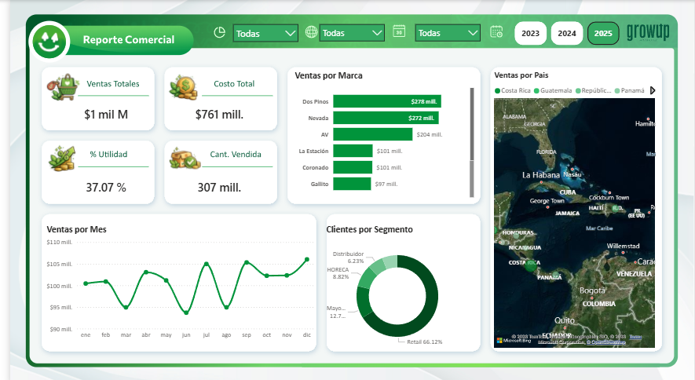
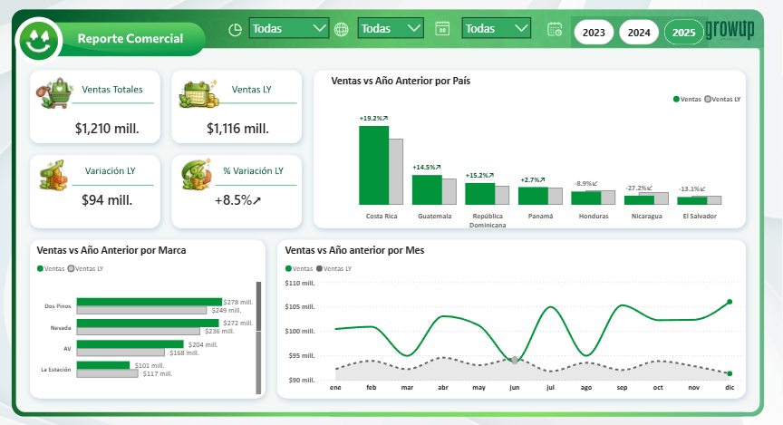
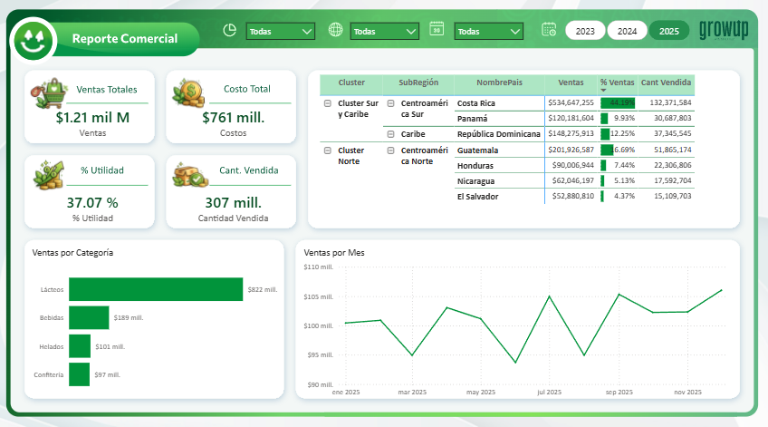

# Análisis Comercial — Caso Dos Pinos | Power BI

## Contexto de negocio

Dos Pinos es una de las cooperativas lácteas más importantes de Centroamérica y el Caribe, con operaciones en varios países y múltiples marcas y líneas de productos. En un mercado competitivo, la empresa necesita información clara y oportuna para evaluar su desempeño comercial y tomar decisiones estratégicas sobre expansión de mercado, rentabilidad por línea de producto y optimización del desempeño comercial.

Como Business Analyst, el reto fue diseñar un reporte comercial interactivo que permitiera analizar indicadores clave como ventas, costos, utilidad, volumen vendido, comportamiento por marca, segmento y país.

## Estructura del proyecto — 3 dashboards con preguntas de negocio

### Dashboard 1 — ¿Qué? ¿Quién? ¿Dónde? ¿Cuándo?
Visión general del desempeño comercial: KPIs de ventas totales, costo, utilidad y cantidad vendida. Análisis por marca, segmento de cliente y distribución geográfica por país.

**Indicadores clave:**
- Ventas Totales: $1 mil M
- Costo Total: $761 mill.
- % Utilidad: 37.07%
- Cantidad Vendida: 307 mill.

**Insights obtenidos:** Dos Pinos y Nevada lideran ventas por marca. El canal Retail representa el 66% de los clientes. Costa Rica concentra la mayor participación geográfica.

---

### Dashboard 2 — ¿Cómo?
Análisis de evolución de ventas vs año anterior por país, marca y mes. Incorpora indicadores de variación absoluta y porcentaje de crecimiento para detectar mercados y marcas con mejor desempeño.

**Indicadores clave:**
- Ventas actuales: $1,210 mill.
- Ventas año anterior: $1,116 mill.
- Variación: +$94 mill. (+8.5%)

**Insights obtenidos:** Costa Rica, Guatemala y República Dominicana muestran crecimiento positivo. Nicaragua y El Salvador presentan caídas que requieren atención estratégica.

---

### Dashboard 3 — ¿Por qué?
Análisis profundo por región, país y tipo de producto para identificar qué mercados y productos están impulsando realmente el negocio. Permite decidir en qué países enfocarse, qué productos impulsar y cómo ajustar la estrategia comercial.

**Indicadores clave:**
- Cluster Sur y Caribe lidera con Costa Rica: $534 mill. (44.13%)
- Categoría Lácteos: $822 mill. — principal motor de ingresos
- Bebidas: $189 mill. | Helados: $101 mill.

**Insights obtenidos:** Los lácteos son el producto principal. El Cluster Norte (Guatemala, Honduras, Nicaragua) representa oportunidad de crecimiento con menor participación actual.

---

## Herramientas utilizadas
- Power BI
- DAX
- Visualización de datos
- Business Analysis
- KPI Development

## Contacto
- 📧 estela.trdz@outlook.com
- 🔗 [LinkedIn](https://www.linkedin.com/in/estela-trujillordz)
