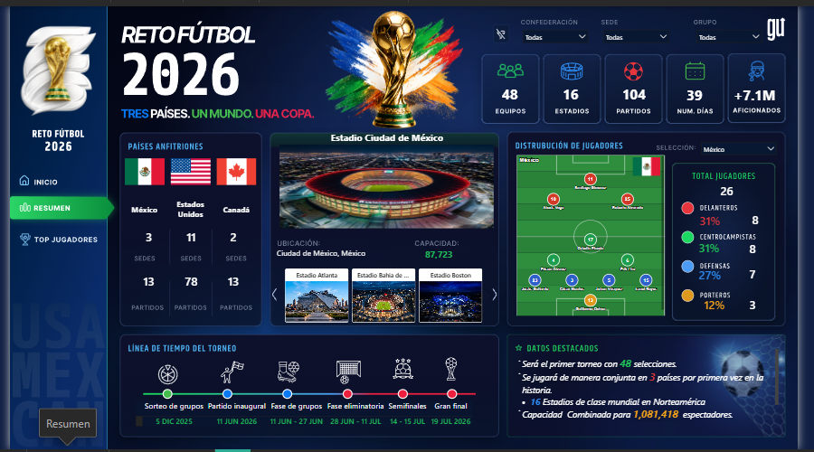
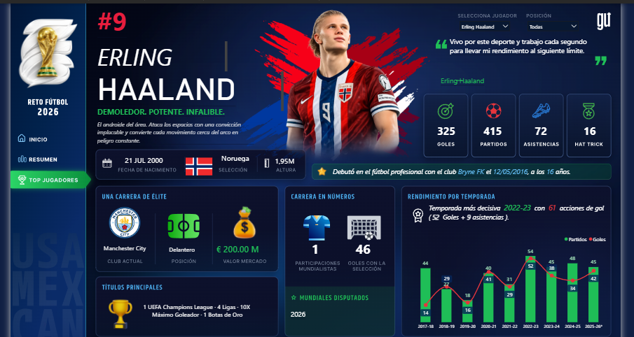

# Reto Fútbol 2026 — Dashboard Interactivo en Power BI

## Contexto
Proyecto desarrollado como parte del **Reto de 14 días: Construyendo un reporte visual de varias pantallas con temática futbolera**, de Grow Up Data Analytics. Iniciado el 18 de junio de 2026.

El dashboard explora la Copa Mundial de Fútbol 2026 — el primer torneo con 48 selecciones y el primero organizado conjuntamente por tres países (México, Estados Unidos y Canadá) — a través de 3 pantallas interactivas.

**Un reto adicional no técnico:** no tengo conocimiento del fútbol más allá de lo general — nombres de jugadores por redes sociales, poco más. Construí este dashboard apoyándome exclusivamente en el análisis de los datos, sin dar nada por sabido del dominio. Esto terminó siendo una prueba útil de una habilidad central de un Business Analyst: estructurar, modelar y extraer valor de cualquier conjunto de datos, sin importar si domino el área de negocio de origen — la misma situación que enfrentaré al entrar a una industria nueva como analista.

## Preguntas de negocio que responde

**¿Qué?** Estructura completa del torneo: 48 equipos, 16 estadios, 104 partidos, 39 días de competencia, capacidad combinada de 1,081,418 espectadores.

**¿Quién?** Distribución de jugadores por selección y posición (ej. México: 26 jugadores — 31% delanteros, 31% centrocampistas, 27% defensas, 12% porteros); perfil individual de jugadores destacados con su trayectoria completa.

**¿Dónde y cuándo?** Distribución de sedes y partidos por país anfitrión (México: 3 sedes / 13 partidos, Estados Unidos: 11 sedes / 78 partidos, Canadá: 2 sedes / 13 partidos); línea de tiempo del torneo desde el sorteo de grupos (5 dic 2025) hasta la gran final (19 jul 2026).

**¿Cómo?** Mediante un modelo de datos relacional (esquema estrella) que conecta selecciones, estadios, jugadores y estadísticas por temporada, permitiendo filtrado dinámico por confederación, sede y grupo.

**¿Por qué?** Para practicar modelado dimensional y DAX en un dataset con múltiples entidades relacionadas — sin conocimiento previo del deporte, forzando a que cada conclusión saliera exclusivamente de los datos y no de intuición o familiaridad con el tema.

## Modelado de datos

Esquema estrella con 6 tablas:
- **Dim_Equipos** — catálogo de selecciones, confederación, grupo
- **Dim_Estadios** — sedes, país, capacidad
- **Dim_Top_Jugadores** — perfil de jugadores destacados
- **Estadisticas_Jugador** — tabla de hechos, estadísticas por temporada
- **Timeline_Mundial** — hitos y fechas del torneo
- **Medidas** — tabla dedicada de medidas DAX (totales, porcentajes por posición, comparativos por país, acciones de gol, etc.)

## Validación de datos

Todos los insights de este proyecto fueron verificados cruzando las medidas del dashboard directamente contra los datasets fuente (`Data_Mundial.xlsx` y `Estadisticas_Jugadores.xlsx`), no solo leídos de las tarjetas visuales. Esta revisión identificó un registro de prueba (jugador ficticio incluido intencionalmente por Grow Up) que fue excluido de cualquier análisis comparativo real.

## Herramientas
Power BI · DAX · Modelado dimensional · Validación de datos · Visuales personalizados (HTML) · Storytelling de datos

## Contacto
- 📧 estela.trujillo.rdz@gmail.com
- 🔗 [LinkedIn](https://www.linkedin.com/in/estela-trujillordz)
