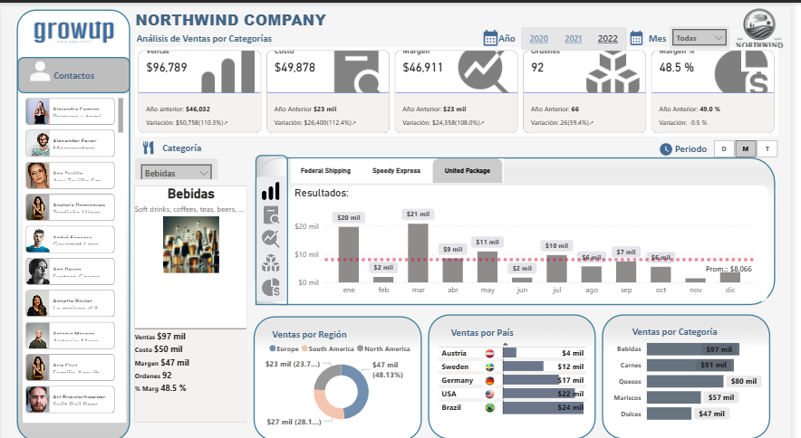

# Dashboard Análisis de Ventas — Reto Grow Up Data Analytics | Power BI

## Contexto de negocio

Northwind Company necesita analizar su desempeño comercial por 
categoría de producto, región, país y transportista para optimizar 
su estrategia de ventas y distribución. Como Business Analyst, el 
reto fue construir un dashboard interactivo en Power BI que permitiera 
monitorear KPIs críticos de negocio y facilitar la toma de decisiones 
estratégicas en tiempo real.

## Preguntas de negocio respondidas

- ¿Cuál es el desempeño actual de ventas, costos y margen por categoría?
- ¿Qué transportista genera mejores resultados por mes?
- ¿Qué regiones y países concentran mayor volumen de ventas?
- ¿Cómo se comportan las ventas a lo largo del tiempo — por día, mes y trimestre?

## Dashboard — Análisis de Ventas por Categorías

**Indicadores clave:**
- Ventas totales: $96,789
- Costo total: $49,878
- Margen: $46,911 (48.5%)
- Órdenes: 92

**Insights obtenidos:**
- Bebidas es la categoría con mayor volumen de ventas: $97 mil
- USA y Brazil lideran ventas por país con $22 mil y $24 mil respectivamente
- United Package supera a Federal Shipping y Speedy Express en meses clave
- América del Norte concentra el 48.13% de las ventas por región — principal mercado

## Herramientas utilizadas
- Power BI
- DAX
- Visualización de datos
- Business Analysis
- KPI Development
- Análisis de datos

## Contacto
- 📧 estela.trujillo.rdz@gmail.com
- 🔗 [LinkedIn](https://www.linkedin.com/in/estela-trujillordz)
