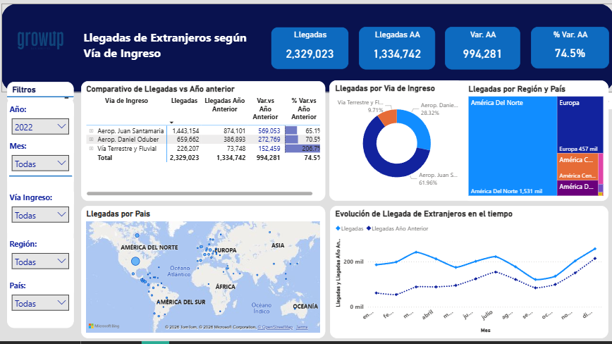

# Análisis de Turismo — Costa Rica | Power BI

## Contexto de negocio

Costa Rica recibe millones de visitantes extranjeros al año a través de 
diferentes vías de ingreso: aeropuertos internacionales y vía terrestre 
y fluvial. Para la planificación estratégica del sector turístico, es 
crítico entender cómo evolucionan las llegadas, qué mercados originan 
más visitantes y cómo se comporta la demanda a lo largo del tiempo.

Como Business Analyst, el reto fue construir un dashboard interactivo 
en Power BI que permitiera analizar el comportamiento de llegadas de 
extranjeros, comparar el desempeño vs año anterior e identificar 
patrones por vía de ingreso, región y país de origen.

## Preguntas de negocio respondidas

- ¿Cuántos visitantes extranjeros llegaron y cómo evolucionó vs el año anterior?
- ¿Por qué vía de ingreso llegan más visitantes?
- ¿De qué regiones y países provienen?
- ¿Cómo se comporta la demanda a lo largo del año?

## Dashboard — Llegadas de Extranjeros según Vía de Ingreso

**Indicadores clave:**
- Llegadas totales: 2,329,023
- Llegadas año anterior: 1,334,742
- Variación absoluta: +994,281
- % Variación: +74.5%

**Insights obtenidos:**
- El Aeropuerto Juan Santamaría concentra el 61.96% de las llegadas — principal puerta de entrada al país
- América del Norte es la región de origen con mayor volumen: 1,531 mil visitantes
- Europa aporta 457 mil visitantes — segundo mercado más importante
- La vía terrestre y fluvial representa solo el 9.71% — oportunidad de análisis de accesibilidad

## Herramientas utilizadas
- Power BI
- DAX
- Visualización de datos
- Análisis de datos
- KPI Development

## Contacto
- 📧 estela.trujillo.rdz@gmail.com
- 🔗 [LinkedIn](https://www.linkedin.com/in/estela-trujillordz)
